[k3s](https://github.com/k3s-io/k3s)学习文档
===============================================

**警告：项目代码存在16处已知安全漏洞，为k3s早期版本，不建议直接投入生产使用，仅作为学习研究需要**

**Warning: There are 16 known security vulnerabilities in the project code, which is the early version of K3S. It is not recommended to be put into production directly, but only for study and research**

## 一、什么是[k3s](https://github.com/k3s-io/k3s)?
引用[原版文档](https://github.com/k3s-io/k3s/blob/master/README.md)：
> 即轻量级k8s，具有`可用于生产`、 `易于安装`、`内存消耗减半（相比k8s）`、`所有组件打包到一个小于100MB的二进制文件`等特性。
> 
> 适用于:
> * Edge
> * IOT
> * CI
> * Development
> * ARM
> * Embedding k8s
> * Situations where a PhD in k8s clusterology is infeasible

## 二、本项目内容说明
代码注解内容包含两部分：

* 针对代码的解析直接通过注释补充的方式
* 针对模块/包的宏观解析可在对应文件夹找到Markdown说明文档

## 三、问题&答案 (Question & Answer):

* 为什么不使用最新版k3s?
    > 为了直接深入k3s最核心的东西，快速把握核心内容，版本选择上选择了第一个正式版, 即`v1.0.0`.

* 为什么文档选用中文?
    > 本次文档以内部快速使用为第一目标，为了追求快捷和方便，文档尽可能追求通俗易懂，英文会一定程度减慢阅读速度。另一方面由于`v1.0.0`版本为较初级的版本，单单从项目贡献的长远角度来看意义不大

* 本项目是否可以用于生产 (Can this project be used in production directly) ？
    > 不行！代码内部存在一些安全漏洞，应该尽量选用[最新版](https://github.com/k3s-io/k3s)，在兼容性和安全性都有更高的保障。此项目仅为了学习目的。(为了避免项目滥用，此处用双语标出)
    >
    > No! There are some security loopholes in the code, so the [latest version](https://github.com/k3s-io/k3s) should be selected as far as possible to ensure higher compatibility and security. This project is only for learning purposes. (In order to avoid project abuse, here is a bilingual version)

* 我是谁？
    > 我不是k3s的开发人员，仅是一名学习者/使用者/云边方向研究者，只能尽最大能力保证信息的可靠性。如果存在内容错误，欢迎读者指出。

## 四、阅读前必看

* `containerd`,`containerd-shim`,`runC`, `ctr`, `cri-tools`, `docker`, `kubelet`是怎样的关系
    
    
    注意：
    * containerd-shim后来直接由containerd集成
    * CRI即`container runtime interface`，是一套约定的容器运行时调用接口。`docker-shim`和`CRI-containerd`都是作为中间件，最初都是在`kubernetes`为了解耦`kubelet`与底层容器运行时。

* golang语言的两个函数
    * `syscall.Exec`和`cmd.Command`(下面为伪代码)
        ```go
        import "os/exec"
        import "syscall"
        import "os"

        // 注意: Linux中/proc/self/exe为特殊路径，可以理解为总是指向当前执行程序的路径

        // exe为待执行的二进制路径，例如 "/usr/bin/ls"
        // args[0]为进程标识，可以与cmd无关联（随便写都可以）。当你使用ps -ef查看时，进程将显示为args[0]的内容
        // args[1:]为命令执行参数，相当于执行shell命令启动 `exe args[1:]...`
        // env即执行时的环境变量，通常传入为 os.Environ()
        syscall.Exec(exe, args, env)    // 此程序如果执行成功(不返回error)，后续代码都不会执行, 原因下面解释

        cmd := exec.Command(exe, args[1:]...) // 相当于执行shell命令启动 `exe args[1:]...`
        cmd.Start() // 开始执行cmd
        cmd.Wait()  // 主进程阻塞等待cmd执行完毕
        ```
        > 区别:
        >
        > `syscall.Exec`会执行参数指定的命令，但是并不创建新的进程，只在当前进程空间内执行，即**替换**当前进程的执行内容，他们**重用同一个进程号PID**。环境变量如果没有通过以上述方式显事传入，那么不会自动继承caller的环境变量。
        > 
        > `exec.Command`则是相当于在程序中执行一个shell命令，形式上更接近子进程。在golang中，由于底层屏蔽了多进程的概念，k3s很多地方通过这种机制实现"子进程"